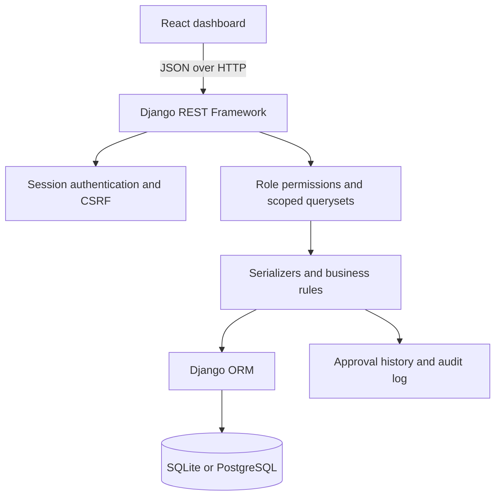

# Student Results Management System

Django REST Framework API with a React dashboard. The backend enforces role and ownership checks, enrolment validation, marks validation, and the draft → submitted → under review → approved/rejected → published workflow. Workflow decisions are recorded in approval and audit records.

## Architecture



The API is the authorization boundary. The frontend hides navigation that does not apply to a role, while the API independently checks the role and scopes records to the user's ownership or assignments.

## Local setup

1. Create a virtual environment and install `requirements.txt`.
2. Copy `.env.example` to `.env`. For a local SQLite setup, set `DB_ENGINE=sqlite` and `DJANGO_DEBUG=true`.
3. Run `python manage.py migrate` and `python manage.py seed_demo_data`.
4. Start the API with `python manage.py runserver`.
5. Optionally set `SCHOOL_NAME` in the backend `.env` to print your institution's name on generated reports. In `frontend`, copy `.env.example` to `.env`, then run `npm install` and `npm start`. Set `REACT_APP_API_URL` if the API is not at `http://localhost:8000/api` and restart the frontend after changing it.

## PostgreSQL

Set `DB_ENGINE=postgresql` and configure `DB_NAME`, `DB_USER`, `DB_PASSWORD`, `DB_HOST`, and `DB_PORT` in `.env`. The SQLite configuration remains useful for local development; production secrets and allowed hosts are read from environment variables. Set `DJANGO_SECRET_KEY`, `DJANGO_DEBUG=false`, `DJANGO_ALLOWED_HOSTS`, and `CORS_ALLOWED_ORIGINS` for deployment.

Enable `DJANGO_SECURE_SSL_REDIRECT=true` only after the site and reverse proxy are configured for HTTPS. Configure `DJANGO_SECURE_HSTS_SECONDS` only when the HTTPS deployment is stable; include subdomains or preload only if every affected host supports HTTPS. These options remain off by default to avoid breaking local HTTP development.

## API areas

- Session authentication and current-user endpoints under `/api/auth/`.
- Super Admin user management is available from the Users workspace; administrators can manage non-admin accounts, while only a Super Admin can grant elevated roles or disable/reactivate accounts.
- Academic year and term creation/editing is available from Academic Settings; only administrators manage academic years, while administrators and academic officers manage terms.
- Role-protected students, teachers, classes, subjects, enrollments, and results.
- Result review, publication, scoped performance reports, and admin/academic-officer audit-log reads.
- Student and teacher account creation uses Django's password hashing.

## Role access

Permissions are enforced by the API on every request; hiding a navigation item is only a UI convenience.

### Role responsibilities

| Role | Responsibility |
| --- | --- |
| Administrator | Manage users, classes, subjects, and academic years. |
| Teacher | Enter and update marks for assigned subjects. |
| Academic Officer | Review and approve results. |
| Student | View their own published results. |
| Head of School | View reports and school performance. |

The current system represents Head of School access through the combined `ACADEMIC_OFFICER` role (`Head/Academic Officer`). It does not yet provide a separate Head of School account role; that role therefore shares the academic officer's permissions in the application.

| Capability | Super Admin | Admin | Academic officer | Teacher | Student |
| --- | --- | --- | --- | --- | --- |
| Dashboard and performance reports | All | All | All | Assigned | Own |
| Manage users | Full, including disable | Limited to non-admin accounts | No | No | No |
| Create/view students | Yes | Yes | View all | Assigned roster | Own record |
| Create/view teachers | Yes | Yes | View | No | No |
| Create/view classes | Yes | Yes | Yes | Assigned view | No |
| Create/view subjects | Yes | Yes | Yes | Assigned view | Enrolled subjects view |
| Create/view academic years | Yes | Yes | View | Read all | Read all |
| Create/view terms | Yes | Yes | Yes | Read all | Read all |
| Create/view enrolments | Yes | Yes | Yes | Assigned view | Own enrolments |
| Enter or edit marks | Full | Full | Full | Assigned subjects (draft/rejected) | No |
| Review and approve results | Full | Full | Full | No | No |
| Publish approved results | Full | Full | Full | No | No |
| Read results | All | All | All | Assigned subjects and class-teacher classes | Own published only |
| Read audit log | Full | Full | Read only | No | No |

Admin accounts cannot grant or modify Super Admin/Admin accounts. Existing Django superusers are promoted to the `SUPER_ADMIN` role by the migration; non-superuser staff accounts lose Django admin access. A user's Django `is_superuser` and `is_staff` flags are kept in sync with that role.

`DELETE /api/users/<id>/` is Super Admin only and performs a soft disable instead of permanently deleting the account, preserving student, teacher, result, and audit history. The last active Super Admin cannot be disabled or demoted.

Deployment configuration such as secret keys, database credentials, allowed hosts, and CORS origins comes from environment variables; it is not exposed through an application settings API. Session-authenticated write requests use CSRF protection, and production mode enables secure session and CSRF cookies. Permissions are checked by the API, and object-level query filtering ensures teachers and students only see records within their assignments or ownership. Class teachers may read results for their assigned classes, while entering or editing marks remains limited to teachers assigned to the subject.

Result reviews lock the result row while checking and applying a workflow transition, so simultaneous approval/rejection attempts cannot both succeed from the same previous state. Enrollment uniqueness and result uniqueness/mark-range rules are also enforced by database constraints.

The dashboard's active-term average is currently the arithmetic mean of published assessment result records. It does not apply CAT/exam weights; the institution's official weighting policy should be configured before treating this as a final student aggregate. List endpoints currently return full result sets, so pagination is a future scalability improvement for larger school deployments.

## Result workflow

```text
DRAFT -> SUBMITTED -> UNDER_REVIEW
UNDER_REVIEW -> APPROVED -> PUBLISHED
UNDER_REVIEW -> REJECTED -> DRAFT
```

Teachers enter marks for assigned subjects. An administrator or academic officer reviews them; the person who entered a result cannot review that same result. Students can read their own results only after publication. Approval decisions are retained in result approval history and the audit log.

Run database schema updates with `python manage.py migrate` after pulling changes.
